# TicTacToeMVC
Eine Android-TicTacToe-App.

## Aufgabenstellung
Schreibe eine Android App, in der man Tic Tac Toe spielen kann. 
Es gibt 2 Spieler, die immer abwechselnd spielen (alles lokal). Ein Spieler ist O und der andere X. Speichere dir ab, wenn ein Spieler gewonnen hat, und wie viele Spiele ein Spieler gewonnen hat. 
Das Spiel soll mit dem MVC Prinzip implementiert werden, das heißt überlege dir genau wie du das ganze Modellieren willst.

## Lösungsansatz
Zu Beginn habe ich versucht mich mit dem MVC-Modell etwas besser vertraut zu machen. 
Zunächst habe ich dann versucht eine möglichst benutzerfreundliche Oberfläche (mit den gegebenen Vorgaben) zu gestalten. 
Anschließend habe ich mich der Logik des Tic-Tac-Toe-Spiels gewidmet. 
Für die verschiedenen Buttons habe ich dann die benötigten Listeners angelegt und die dementsprechend folgenden Aktionen ausprogrammiert. 
Am Ende habe ich dann eine Datenbank angelegt, in der die Ergebnisse des Spiels gespeichert werden sollen.

## Aufbau
Wie bereits erwähnt wurde das Programm nach dem MVC-Prinzip implementiert.

### Model
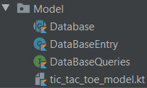

### View
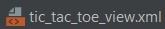

### Controller
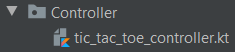

## UI

### GUI
<table>
  <tr>
    <td width="300" height="576">
      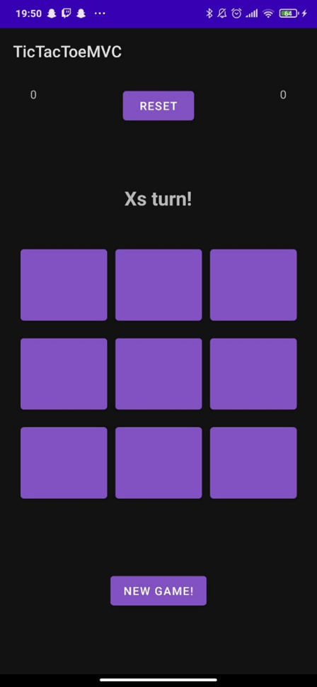
    </td>
    <td>
      Die Oberfläche meiner App sieht so aus. 
      Oben links und rechts in den Ecken wird der Spielstand ausgegeben. Mit dem Button „Reset“ in der Mitte kann man den Spielstand zurücksetzen. Dieser wird dann auch gleich in der Datenbank zurückgesetzt. 
      Über dem Spielfeld sieht man ein Feld, wo der Status des Spiels (sprich X/O ist dran, X/O hat gewonnen, Unentschieden) angezeigt wird. 
      Darunter sieht man das Spielfeld, wo man ganz gewöhnlich Tic-Tac-Toe spielen kann. 
      Mit dem Button „New Game“ kann man das Spielfeld zurücksetzen.
    </td>
  </tr>
</table>
  
### Game States
<table>
  <tr>
    <td width="20%">
      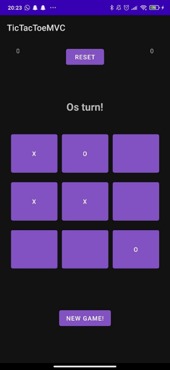
    </td>
    <td width="20%">
      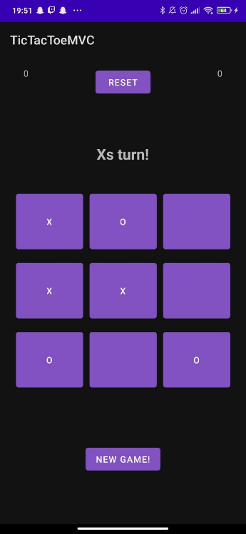
    </td>
    <td width="20%">
      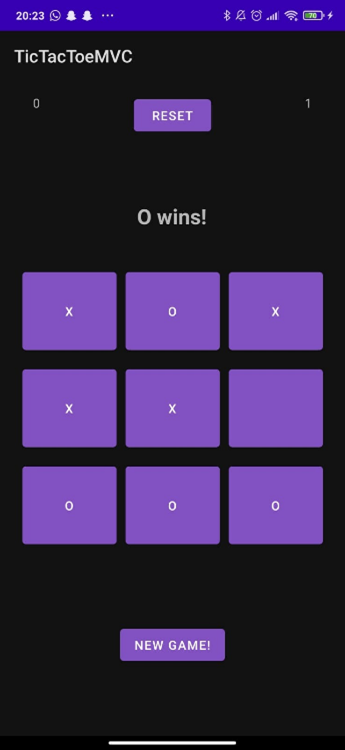
    </td>
    <td width="20%">
      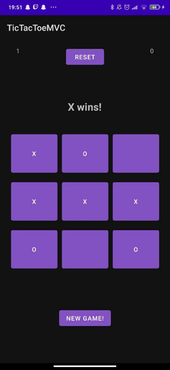
    </td>
    <td width="20%">
      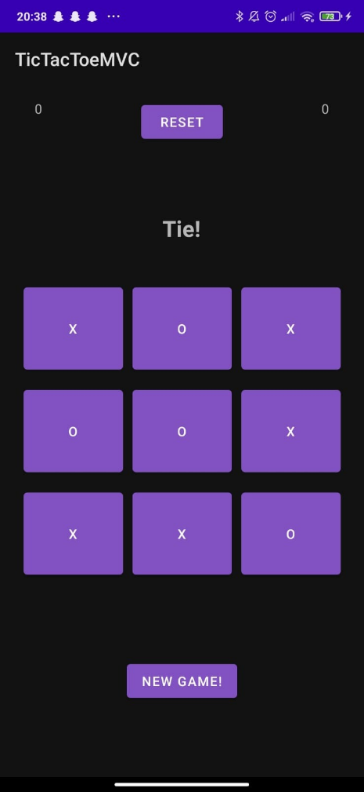
    </td>
  </tr>
</table>
Wie in diesen Bildern zu sehen ist, kann man ganz normal nach Tic-Tac-Toe-Regeln Tic-Tac-Toe spielen. Wie weiter oben bereits erwähnt, wird über dem Spielfeld angezeigt, wer dran ist bzw. wer gewonnen hat. Wie in den beiden Bildern rechts angezeigt wird, aktualisiert sich der Punktestand im Spiel und auch in der Datenbank.

### Resets
<table>
  <tr>
    <td width="50%">
      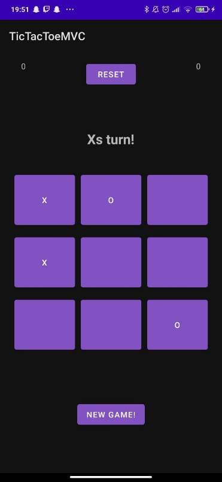
    </td>
    <td width="50%">
      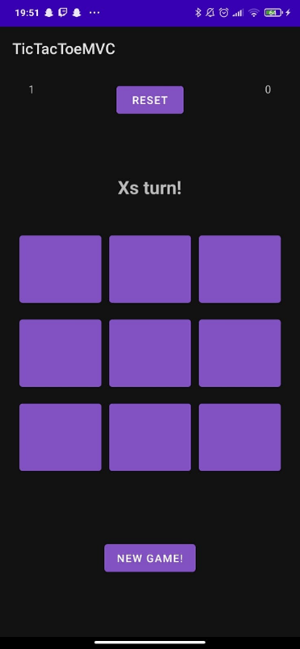
    </td>
  </tr>
</table>
Betätigt man den Button „New Game“, so wird das Spielfeld, wie bereits erwähnt, zurückgesetzt.
Betätigt man wiederum den Button „Reset“, so wird der Spielstand im Spiel und auch in der Datenbank zurückgesetzt.

## Fazit
Das Schwierige am Ausimplementieren dieses Tic-Tac-Toe-Spiels war, es im MVC-Prinzip auszuimplementieren. Dafür musste ich mich mit dem Prinzip zunächst zeitaufwendig bekannt machen und nach einem Tutorial Ausschau halten.
Das Nutzen der Datenbank erzeugte zunächst auch Probleme, die ich dann aber lösen konnte.
